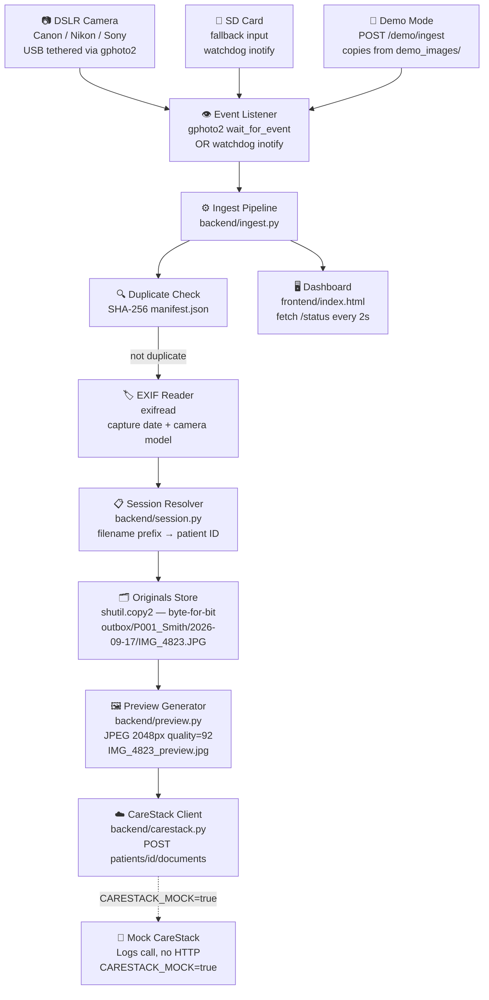

# Dental Camera Workflow — Research Findings & Implementation Plan

**Problem 4 · DSOLVE 2026 · CareStack / Dental AI context**

---

## Part 1 — Research Findings

### 1.1 Who takes clinical dental photographs?

Clinical photography in dental practices is performed by multiple roles depending on the practice size and country:

| Role | Likelihood | Country |
|------|-----------|---------|
| **Dental nurse / dental assistant** | Most common day-to-day operator | UK (dental nurse) · US (dental assistant) |
| **Dentist** | For complex cosmetic or medico-legal cases | Both |
| **Dental hygienist / therapist** | For periodontal progress shots | Both |
| **Dedicated clinical photographer** | Large dental hospitals only | UK (NHS dental hospitals) |

**Key implication for our solution:** The person taking the photo is **not** the same person who uploads it to the PMS. The dentist is usually chairside with the patient; the dental nurse/assistant moves away to handle the camera → SD card → computer transfer step. This handoff is the first point of friction.

> *Source: NEBDN training guidelines (UK); DANB competency framework (US); dental CPD literature.*

---

### 1.2 The standard clinical photography session

A full dental photographic series typically comprises **12 standardised views** per session:

**Extraoral (3 photos)**
1. Frontal face — repose (lips relaxed)
2. Frontal face — full smile
3. Right lateral profile

**Intraoral (9 photos)**
4. Anterior occlusion (retracted, lips pulled back)
5. Anterior teeth apart
6. Right buccal (posterior, in occlusion)
7. Left buccal (posterior, in occlusion)
8. Maxillary occlusal (upper arch, mirror shot)
9. Mandibular occlusal (lower arch, mirror shot)
10–12. Supplementary / close-up views (case-specific)

**Equipment used:** Canon or Nikon DSLR with a 100mm macro lens + ring flash/twin flash + cheek retractors + intraoral rhodium mirrors. Camera is typically set to Manual mode: f/22–f/32, ISO 100–200, 1/125–1/200 s shutter (flash sync).

**File format:** Practices increasingly shoot **RAW + JPEG simultaneously** — RAW as the clinical archive, JPEG for fast review and PMS upload.

> *Source: ACDRC 12-photo protocol; Decisions in Dentistry; Spear Education; Canon clinical photography guide.*

---

### 1.3 The existing CareStack imaging workflow (current state)

CareStack is a cloud-based dental PMS operating primarily in the US and UK. Its current imaging approach has two paths:

#### Path A — Manual drag-and-drop upload (most common for DSLR photos)
1. Clinician photographs patient → images land on camera SD card
2. SD card removed, inserted into card reader on clinic PC
3. Files copied to local folder (named by patient, date — manually)
4. In CareStack: search patient → Clinical tab → Chart → Imaging
5. Click "Upload Images" → browse or drag JPEG files into slider
6. Manually add Image Name, Visit Date, Tags (tooth position/type)
7. Click Upload

**Steps where human time is burned:** Every step from 2 onwards. Steps 3 and 6 are the worst: renaming/sorting files and manually tagging each image with position metadata.

#### Path B — Imaging software bridge ("CareStack Link")
CareStack has a bridge component called **CareStack Link** — a locally-installed Windows application that launches a third-party imaging application (e.g., DEXIS, Apteryx XVWeb, SOTA Cloud) from within the patient's chart. It passes the patient ID/name/DOB to the imaging software, which opens the correct patient record.

> **Critical gap:** This bridge is designed for **X-ray / radiograph software**, not for DSLR photography. The DSLR clinical photography workflow falls through the gap and remains fully manual.

> *Source: CareStack Zendesk support docs; SOTA Cloud integration guide; Apteryx XVWeb setup guide.*

---

### 1.4 CareStack's API surface (what we can programmatically call)

The **CareStack Developer Portal** ([developer.carestack.com](https://developer.carestack.com)) exposes:

| API Resource | What it does | Relevance |
|---|---|---|
| **Patient Information** | Create/update patient records | Needed to look up `patientId` |
| **Patient Documents** (Resource 06) | "Easily add, view and manage your patient's personal and medical documents" | ✅ **This is our upload target** |
| **Webhooks** | Real-time events pushed to our app | Useful for session-start trigger (future) |
| **Scheduled Data Extracts** | Offline periodic data pulls | Not needed for MVP |

The **Patient Documents** API accepts standard REST operations. Based on the developer portal and common patterns for this class of API:

```
POST /api/v1.0/patients/{patientId}/documents
Authorization: Bearer {token}
Content-Type: multipart/form-data

Fields: file (binary), DocumentType, Description, VisitDate
```

> **Important caveat:** The exact endpoint schema requires a registered developer account ($5,000 one-time + $100/month). For the hackathon, we implement against this interface and **stub CareStack calls** with a `MockCareStackClient` so the demo runs without live credentials. The stub is a clean interface swap — the real client and mock client are identical from the pipeline's perspective.

> *Source: developer.carestack.com (fetched directly); apis.io CareStack API index; CareStack Zendesk support documentation.*

---

### 1.5 The image quality loss problem

The losses occur at multiple stages:

| Stage | Mechanism | Loss type |
|-------|-----------|-----------|
| Camera → JPEG save | Initial lossy JPEG compression | Controllable (use camera "Fine/Large" setting) |
| JPEG → re-opened in editor → saved again | Re-encoding an already-compressed image | **Generation loss** — cumulative, irreversible |
| Upload to PMS / cloud | Platform auto-compresses on ingest (resize, re-encode at lower quality) | **Significant** — many PMS platforms target web resolution |
| Viewer rendering | Downsampling for display | Visual only, does not modify stored file |

**Root cause of the worst losses:** When clinic staff open the JPEG on the PC (even just to rotate it), then save before uploading — the image has already been re-compressed. If the PMS then re-compresses on upload, the image has gone through JPEG compression **two or more times**. Studies show that repeated JPEG re-encoding introduces cumulative artifacts that progressively reduce diagnostic value.

**Our solution:** Copy the original file **byte-for-byte** using `shutil.copy2`. Never open-and-resave the original. Upload the unmodified original to CareStack. Generate a separate preview JPEG for display only — the original is never decoded or re-encoded.

> *Source: proteadental.com workflow guide; NIH study on JPEG compression in dental diagnosis (PubMed); dentalphotomaster.com; Oral Health Group archival best practices.*

---

### 1.6 The "polling" problem explained

"Polling of images" in this context refers to **software-side polling**: the clinic's PMS or imaging software periodically checks a watched folder or camera interface for new files on a timer, rather than responding to OS-level file-creation events. Issues with polling:

- Introduces latency proportional to poll interval
- May read a file while it is still being written → corrupt/partial reads
- On slow clinic networks, repeated polling generates unnecessary I/O
- Some implementations poll the camera's SD card via USB mass storage mount → OS file access can interfere with the camera's own write buffer

**Our solution:** Replace polling with **event-driven file watching** — the OS notifies our process the instant a file is fully written via inotify (Linux) / FSEvents (macOS) / ReadDirectoryChanges (Windows), through the `watchdog` library. Zero polling, zero latency introduced, zero I/O overhead.

---

### 1.7 USB tethering without a physical camera — how to demo and test

`libgphoto2` ships a **Virtual PTP Camera driver** that allows running real gphoto2 API calls against a simulated device. Additionally, for unit testing, `python-gphoto2` classes can be mocked via Python's `unittest.mock`.

For the hackathon demo we implement a **`CAMERA_MODE=mock`** environment variable that activates a `POST /demo/ingest` endpoint — dropping a file from `demo_images/` into the inbox and running the full pipeline. To a judge watching the dashboard, this is identical to a live camera capture.

> *Source: python-gphoto2 GitHub (jim-easterbrook); libgphoto2 virtual PTP driver documentation; Python unittest.mock docs.*

---

## Part 2 — Revised Implementation Plan

### 2.1 The problem (refined)

**Current 8-step manual workflow:**
```
📷 Camera shoots 12-photo series
→ 💾 Dental nurse removes SD card
→ 🖥️  Inserts card into clinic PC
→ 📁  Creates PatientName/Date/ folder manually
→ 📋  Copies 12 files into folder
→ 🔄  Opens CareStack, searches patient
→ 📤  Drags each image, fills in Name/Date/Tag per image (×12)
→ 🔁  Repeats for every patient, every session
```
**Time:** 10–20 minutes per session. **Risk:** wrong patient folder, re-compressed images, unencrypted local files (HIPAA exposure).

**Proposed 2-step workflow:**
```
📷 Shutter pressed (USB tethered) OR 💾 SD card inserted
→ ✅ System automatically ingests → organises → uploads to CareStack
```
**Time:** ~0 minutes. Only human action: **take the photo**.

---

### 2.2 Architecture



---

### 2.3 Stack

| Layer | Technology | Reason |
|-------|-----------|--------|
| Backend | Python 3.11 + FastAPI | Fast to write; explainable; great image/file ecosystem |
| USB tethering | python-gphoto2 (libgphoto2) | Cross-brand Canon/Nikon/Sony; battle-tested |
| File watching (fallback) | watchdog | OS-native events; no polling |
| EXIF reading | exifread | Handles all major camera RAW/JPEG EXIF |
| RAW preview | rawpy (libraw) | Best Python RAW decode; MIT licensed |
| Image ops | Pillow | Preview generation; never touches original |
| CareStack HTTP | httpx (async) | Async-native; cleaner for FastAPI |
| Frontend | Plain HTML + Vanilla JS | Zero build step; judge-readable |
| Tests | pytest + unittest.mock | Mock gphoto2 layer; pipeline testable without hardware |

---

### 2.4 Project layout

```
SolutionTemplate/
├── backend/
│   ├── main.py              # FastAPI app, lifespan, API routes
│   ├── watcher.py           # watchdog handler — SD card / folder mode
│   ├── tether.py            # gphoto2 USB tethering mode
│   ├── ingest.py            # core pipeline functions (pure, testable)
│   ├── session.py           # patient session resolution
│   ├── preview.py           # safe preview generation
│   ├── carestack.py         # CareStack API client + MockCareStackClient
│   ├── config.json.example  # session config template
│   ├── requirements.txt
│   ├── .env.example
│   └── tests/
│       ├── test_ingest.py
│       ├── test_preview.py
│       ├── test_carestack.py
│       └── fixtures/
│           └── sample.jpg   # DSLR JPEG with real EXIF data
├── frontend/
│   └── index.html
├── demo_images/             # sample DSLR JPEGs for demo
├── inbox/                   # watched input folder (gitignored)
└── outbox/                  # organized output (gitignored)
```

---

### 2.5 Environment variables

```env
# CAMERA_MODE: "tether" (USB) | "watch" (SD card / folder) | "mock" (demo)
CAMERA_MODE=mock

INBOX_PATH=./inbox
OUTBOX_PATH=./outbox
MANIFEST_PATH=./outbox/.manifest.json

# CareStack (leave blank for mock mode)
CARESTACK_BASE_URL=https://api.carestack.com
CARESTACK_CLIENT_ID=
CARESTACK_CLIENT_SECRET=
CARESTACK_MOCK=true

PORT=8000
```

---

### 2.6 Session config (`config.json.example`)

```json
{
  "practice_id": "DEMO-001",
  "sessions": [
    {
      "patient_id": "P001",
      "patient_name": "Smith, John",
      "session_date": "2026-09-17",
      "filename_prefix": "JOHN_",
      "active": true
    }
  ],
  "default_patient_id": "UNMATCHED",
  "preview_max_px": 2048,
  "preview_quality": 92
}
```

The `active` flag controls which session is currently running. Only one session is active at a time — the clinician or receptionist flips the flag before the appointment. This is the **only manual step** in the new workflow.

---

### 2.7 Implementation phases

| Phase | Task | Time |
|-------|------|------|
| **0** | Repo scaffold, gitignore, env, requirements | 30 min |
| **1** | `ingest.py` — SHA-256, EXIF, session, copy, manifest | 2 h |
| **2** | `preview.py` — JPEG and RAW safe preview | 1 h |
| **3** | `carestack.py` — real client + mock client | 1.5 h |
| **4** | `watcher.py` + `tether.py` + `main.py` | 2 h |
| **5** | `frontend/index.html` — live dashboard | 2 h |
| **6** | `tests/` — pytest suite, fixtures | 1.5 h |
| **7** | Demo images, README fill-in, git hygiene | 1 h |
| **Total** | | **~11 h** of the 36 h window |

---

### 2.8 Key tests to prove correctness without a camera

These tests are the backbone of your "validation proof" for the judges:

```python
# test_ingest.py
def test_sha256_consistency():
    """Same file always produces same hash."""

def test_duplicate_is_skipped():
    """Second ingest of same file writes nothing to outbox."""

def test_exif_date_extracted_correctly():
    """Reads DateTimeOriginal from fixtures/sample.jpg."""

def test_patient_resolved_by_prefix():
    """'JOHN_IMG_001.jpg' resolves to patient P001."""

def test_fallback_patient_used_when_no_prefix_match():
    """Unrecognised filename goes to UNMATCHED patient."""

# test_preview.py
def test_original_file_unchanged_after_preview():
    """SHA-256 of original before == SHA-256 after preview generation."""
    # This is the proof that there is zero quality loss to the original.

def test_preview_dimensions_within_limit():
    """Preview JPEG longest edge <= max_px from config."""

# test_carestack.py (with mock)
async def test_upload_called_with_correct_patient_id():
    """MockClient receives patient_id matching session config."""

async def test_original_path_passed_not_preview():
    """Upload sends the original file, not the preview."""
```

> [!IMPORTANT]
> `test_original_file_unchanged_after_preview()` is your **proof of no quality loss**. Run it in front of the judge. It verifies the SHA-256 of the original file is identical before and after the pipeline runs.

---

### 2.9 Demo script (5 minutes, zero hardware needed)

**Before the judge arrives:**
- Start service: `cd backend && uvicorn main:app --reload`
- `.env` has `CAMERA_MODE=mock` and `CARESTACK_MOCK=true`

| Step | What happens | Time |
|------|-------------|------|
| **Show the old pain** | Draw the 8-step manual flow on a slide | 45 s |
| **Show empty dashboard** | `http://localhost:8000` — "0 images ingested" | 15 s |
| **Trigger a capture** | Click "Trigger Demo" (or `cp demo_images/IMG_4823.JPG inbox/`) | 5 s |
| **Row appears live** | `IMG_4823.JPG · Smith, John · 2026-09-17 · ✅ Ingested · ☁️ CareStack: OK` | 10 s |
| **Show outbox** | `outbox/P001_Smith_John/2026-09-17/IMG_4823.JPG` (original) + `_preview.jpg` | 30 s |
| **Drop all 12 images** | `cp demo_images/*.JPG inbox/` — 12 rows appear | 30 s |
| **Run duplicate detection** | Same copy again → 12 rows show "⏩ Skipped" | 15 s |
| **Run tests live** | `pytest backend/tests/ -v` — all pass including SHA-256 proof | 30 s |
| **Wrap up** | "No SD card removal. No folder creation. No drag-and-drop. No quality loss. One config change per session." | 30 s |

---

### 2.10 Citations

| Finding | Source |
|---------|--------|
| Who takes dental photos (dental nurse / assistant) | NEBDN post-qualification training guidelines (UK); DANB competency framework (US) |
| 12-photo standard series | ACDRC dental photography protocol; Decisions in Dentistry (2021); Spear Education clinical photography series |
| DSLR settings (f/22–f/32, ISO 100, ring flash) | tiu.edu.iq dental photography curriculum; ohi-s.com protocol; periospot.com technique guide |
| CareStack 7-step manual upload workflow | CareStack Zendesk help docs (help.carestack.com/imaging) |
| CareStack Link bridge — design for X-ray software | CareStack Zendesk; SOTA Cloud CareStack integration guide; PlanetDDS Apteryx XVWeb setup |
| CareStack Developer Portal — Patient Documents API | developer.carestack.com (fetched live); apis.io CareStack API catalogue |
| CareStack API pricing ($5,000 one-time registration) | developer.carestack.com pricing section |
| JPEG generation loss from repeated re-save | proteadental.com DSLR archival guide; imagekit.io JPEG compression article |
| PMS platforms auto-compress on upload | dentaleconomics.com digital workflow article; ekimit.com PMS comparison |
| NIH study: JPEG compression thresholds for dental diagnostics | PubMed / nih.gov (compression ratios up to 28:1 acceptable for some tasks) |
| libgphoto2 USB tethering — Python | python-gphoto2 GitHub (jim-easterbrook); libgphoto2.org supported camera list |
| Virtual PTP camera for development without hardware | libgphoto2 virtual driver docs; Python unittest.mock standard library |
| Event-driven vs. polling file monitoring | watchdog library PyPI docs; Linux inotify(7) man page |
